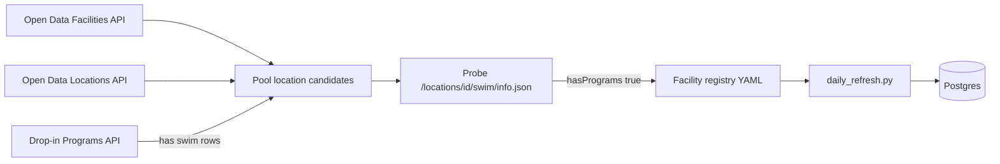

# Epic: Full Toronto public pool coverage + auto-discovery pipeline

**Status:** Draft  
**Target release:** v0.9.0  
**Depends on:** Outdoor Pools (v0.8.3 — `has_indoor`/`has_outdoor`, `pool_type` filter, JSON API for Ourland/Greenwood)

## Goal

Make SwimTO the **centralized schedule for all City of Toronto public recreation pools** — indoor, outdoor, and sites with both — without hand-editing `toronto_pools_data.py` and `curated_json_facilities.py` for every new facility.

**In scope:** City-operated indoor/outdoor pools with drop-in or Parks JSON swim schedules.  
**Out of scope:** Private/hotel/condo pools, wading pools without lane/leisure programs, non-Toronto cities (separate epic).

## Current state (post v0.8.3)

| Layer | Count | Notes |
|-------|-------|-------|
| Curated entries in `toronto_pools_data.py` | ~49 | Manual metadata (lat/lng, district, flags) |
| JSON API allowlist (`curated_json_facilities.py`) | 2 | Norseman (797), Ourland (857) |
| Prod facilities with lane swim | ~26 | Subset of curated list |
| Toronto Open Data — indoor pool locations | ~64 | `Indoor Pool Tank*` asset types |
| Toronto Open Data — outdoor pool locations | ~59 | `Outdoor Pool Tank` |
| Drop-in ingest — unmatched locations | logged daily | Sessions skipped when facility not in DB |

**Bottlenecks:** manual curation, tiny JSON allowlist, drop-in → facility name matching, no coverage visibility.

---

## Phase 1 — Add remaining public pools (manual batch)

One-time expansion using discovery output (see Phase 2 script) **before** full automation ships.

### 1.1 Inventory gap

- [ ] Run `discover_swim_facilities.py --report-only` (Phase 2) and export CSV: location_id, name, source (`open_data` \| `json_api` \| `both`), pool flags, session count estimate.
- [ ] Cross-reference with `toronto_pools_data.py` slugs and prod DB `facilities` table.
- [ ] Prioritize: locations with **lane swim** in drop-in API or `hasPrograms: true` on JSON API.

### 1.2 Batch add metadata

For each approved location:

- [ ] Add entry to `toronto_pools_data.py` with `has_indoor` / `has_outdoor` (not legacy `is_indoor` alone).
- [ ] Set `has_lane_swim`, `website` (`toronto.ca/.../location/?id={id}`), lat/lng from locations dataset.
- [ ] If drop-in-only: no JSON allowlist entry needed.
- [ ] If JSON-only (like Ourland): add matching slug to `curated_json_facilities.py`.

**Acceptance:** Open Data swim locations with active programs are either in DB or explicitly excluded with reason in `data-pipeline/config/excluded_facilities.yaml` (new file).

### 1.3 Improve drop-in matching

- [ ] Extend `match_facility_to_db()` in `daily_refresh.py` to use **Location ID** as primary key when present (not only normalized name).
- [ ] Store `toronto_location_id` on `facilities` table (migration `004_add_toronto_location_id.sql`) for stable joins.
- [ ] Backfill location IDs from Open Data for existing facilities.

**Acceptance:** `daily_refresh` unmatched-location count drops to near zero for locations we intend to cover.

### 1.4 Coverage dashboard (lightweight)

- [ ] `GET /api/v1/admin/coverage` (or internal script): curated vs DB vs Open Data swim rows vs JSON-probed count.
- [ ] Log summary at end of `daily_refresh` (Prometheus metric optional follow-up).

---

## Phase 2 — Auto-discovery pipeline (core epic)

Replace “grep toronto.ca and edit Python dicts” with a **weekly discovery job** that proposes and optionally auto-registers swim facilities.

### Architecture



### Story 2.1 — Discovery script

**New file:** `data-pipeline/jobs/discover_swim_facilities.py`

| Step | Action |
|------|--------|
| 1 | `TorontoDropInAPI.fetch_facilities()` — filter `FacilityType` matching `Indoor Pool Tank*`, `Outdoor Pool Tank` |
| 2 | `fetch_locations()` — enrich with `LocationName`, address, lat/lng |
| 3 | `fetch_drop_in_programs()` + `filter_swim_activities()` — mark locations with swim drop-in rows |
| 4 | For each candidate `location_id`, `GET .../locations/{id}/swim/info.json` (reuse `TorontoParksJSONAPI._fetch_swim_info`) with rate limit (~1 req/s) |
| 5 | Classify: `drop_in_only`, `json_only`, `both`, `no_programs` |
| 6 | Diff against DB + `toronto_pools_data.py` + `curated_json_facilities.py` |

**CLI flags:**

```bash
python jobs/discover_swim_facilities.py --report-only          # stdout + data/discovery/report.json
python jobs/discover_swim_facilities.py --write-registry       # update data/facility_registry.generated.yaml
python jobs/discover_swim_facilities.py --probe-limit 5        # dry-run probe cap
```

**Acceptance:** Script completes in &lt;5 min; report lists all ~120 pool locations with source classification.

### Story 2.2 — Generated facility registry

**New file:** `data-pipeline/data/facility_registry.generated.yaml` (generated, committed after review)

```yaml
# Example entry — human-reviewed before promote
- location_id: 857
  slug: ourland-park-outdoor-pool
  name: Ourland Park Outdoor Pool
  has_indoor: false
  has_outdoor: true
  schedule_source: json_api  # drop_in | json_api | both
  json_api: true
  discovered_at: 2026-06-09
  reviewed: true
```

**New file:** `data-pipeline/data/facility_registry.overrides.yaml` — manual exclusions and field fixes (never overwritten by generator).

**Refactor:**

- [ ] `toronto_pools_data.py` becomes thin loader: `get_all_swim_pools()` reads merged registry (generated + overrides).
- [ ] `curated_json_facilities.py` derives JSON allowlist from registry where `schedule_source` in (`json_api`, `both`).

**Acceptance:** Adding Ourland requires **zero** Python edits — only set `reviewed: true` in generated YAML (or auto-review when probe + drop-in agree).

### Story 2.3 — Wire discovery into ops

- [ ] Kubernetes CronJob `swimto-discover-facilities` — weekly, same image as data-pipeline.
- [ ] On drift (new `json_only` location or new swim drop-in at unknown location): log warning + optional GitHub issue via workflow dispatch (stretch).
- [ ] Extend `validate_facility_urls.py`: flag **“JSON API available (`hasPrograms`) but not in registry”** and **“registry entry 404 on toronto.ca”**.

### Story 2.4 — Auto-register mode (opt-in)

- [ ] `discover_swim_facilities.py --apply` upserts facilities with `reviewed: true` only.
- [ ] `daily_refresh` step 1 calls registry loader instead of static dict.
- [ ] Feature flag `AUTO_REGISTER_DISCOVERED=false` in pipeline config until Phase 1 review complete.

**Acceptance:** New outdoor pool appears in prod within one refresh cycle after `reviewed: true` — no code deploy.

### Story 2.5 — Tests & docs

- [ ] Unit tests: probe mock (`info.json` with/without `hasPrograms`), registry merge, location-id matching.
- [ ] Update [`JSON_API_FACILITIES.md`](JSON_API_FACILITIES.md) — discovery replaces manual allowlist workflow.
- [ ] Update [`ROADMAP.md`](ROADMAP.md) and marketing copy when coverage &gt;90% of public pool locations.

---

## Success metrics

| Metric | Baseline (v0.8.3) | Target (v0.9.0) |
|--------|-------------------|-----------------|
| Public pool locations in DB | ~26 lane-swim | ≥55 (all JSON + drop-in swim sites) |
| JSON allowlist size | 2 | Auto-derived (est. 10–20 JSON-only sites) |
| Unmatched drop-in swim sessions / refresh | unknown (logged) | &lt;1% of swim rows |
| Manual Python edits per new pool | 2 files | 0 (registry review only) |

---

## Implementation order

1. **2.1** Discovery script + report (unblocks Phase 1 inventory)  
2. **1.3** `toronto_location_id` + matching fix  
3. **1.2** Batch add from report (human review)  
4. **2.2** Registry refactor  
5. **2.3** Weekly cron + validator extensions  
6. **2.4** Auto-register (flag-gated)  
7. **1.4** Coverage endpoint / refresh summary  

---

## GitHub tracking

**Epic:** [#178 — Full Toronto public pool coverage + auto-discovery pipeline](https://github.com/raolivei/swimTO/issues/178)

| Issue | Title |
|-------|-------|
| [#179](https://github.com/raolivei/swimTO/issues/179) | `feat(pipeline): discover_swim_facilities.py — Open Data + JSON probe report` |
| [#180](https://github.com/raolivei/swimTO/issues/180) | `feat(db): migration 004 toronto_location_id + backfill` |
| [#181](https://github.com/raolivei/swimTO/issues/181) | `fix(pipeline): match drop-in programs by location_id` |
| [#182](https://github.com/raolivei/swimTO/issues/182) | `feat(pipeline): facility registry YAML — replace static toronto_pools_data` |
| [#183](https://github.com/raolivei/swimTO/issues/183) | `chore(ops): weekly discover-facilities CronJob` |
| [#184](https://github.com/raolivei/swimTO/issues/184) | `feat(pipeline): validate_facility_urls — JSON-available-not-registered check` |
| [#185](https://github.com/raolivei/swimTO/issues/185) | `feat(api): coverage summary endpoint or refresh metrics` |
| [#186](https://github.com/raolivei/swimTO/issues/186) | `docs: update JSON_API_FACILITIES + marketing for full-city scope` |

---

## References

- [`toronto_drop_in_api.py`](../data-pipeline/sources/toronto_drop_in_api.py) — `FACILITIES_URL`, `LOCATIONS_URL`, swim filter
- [`toronto_parks_json_api.py`](../data-pipeline/sources/toronto_parks_json_api.py) — `_fetch_swim_info(location_id)`
- [`daily_refresh.py`](../data-pipeline/jobs/daily_refresh.py) — unmatched location logging
- [`discover_facility_urls.py`](../data-pipeline/jobs/discover_facility_urls.py) — prior art for Open Data matching (URLs only)
- [`validate_facility_urls.py`](../data-pipeline/jobs/validate_facility_urls.py) — facilities CSV + HTTP checks
- Outdoor pools shipped: [#173](https://github.com/raolivei/swimTO/issues/173), v0.8.3
